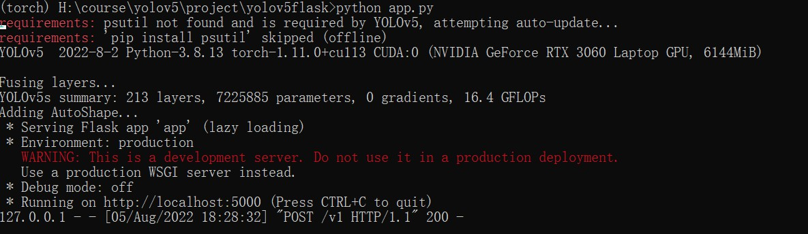
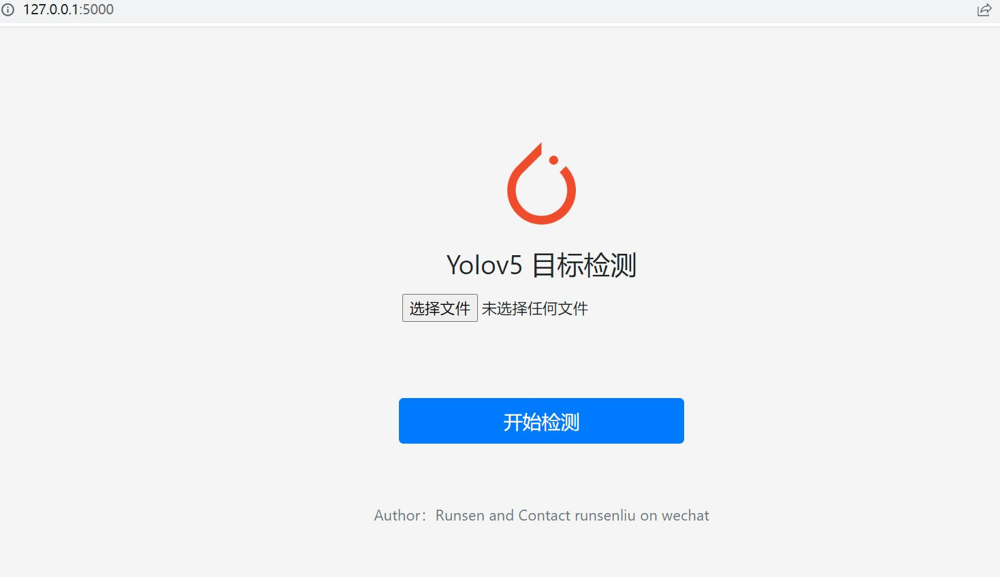
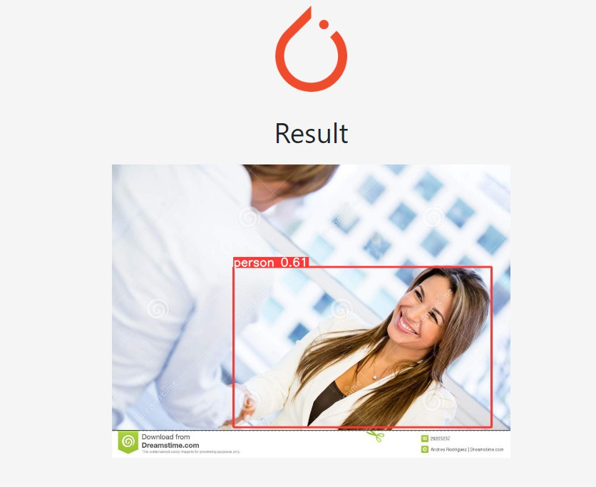
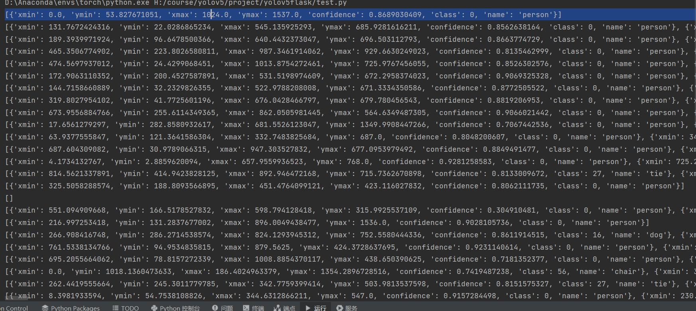
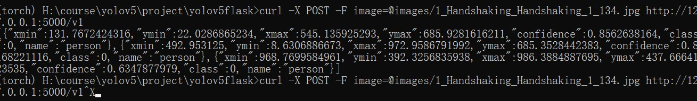
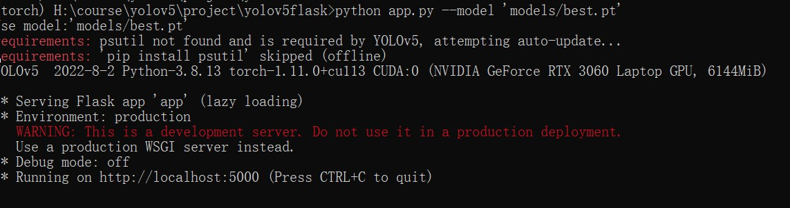

@Author: Runsen

## 基于flask和网页端部署yolo自训练模型

关于yolov5模型的flask的部署, 需要通过torch.hub.load 加载yolov5 自定义的模型，source需要设置local

```python
if opt.model == "yolov5":
    model = torch.hub.load("yolo", "custom", path="models/yolov5s.pt", source='local')
else:
    print("Use model:" + opt.model)
    model = torch.hub.load("yolo", "custom", path=opt.model, source='local')
```

在torch的环境，运行app.py 




对此有两个可以访问的接口

- http://127.0.0.1:5000

- http://127.0.0.1:5000/v1

直接访问`http://127.0.0.1:5000`




选择文件进行图片上传




检测的图片会保存在static中的forest文件夹

关于 http://127.0.0.1:5000/v1 接口，返回的是检测结果

```python
[{'xmin': 0.0, 'ymin': 53.827671051, 'xmax': 1024.0, 'ymax': 1537.0, 'confidence': 0.8689030409, 'class': 0, 'name': 'person'}]
```
可以直接运行test.py




也可以通过curl对图片进行上传访问

```python
curl -X POST -F image=@images/1_Handshaking_Handshaking_1_134.jpg http://127.0.0.1:5000/v1
```



本项目支持运行自己的自训练模型的模型

```python
>python app.py --model 'models/best.pt'
```


关于models里面的模型，一个是官方yolov5s.pt，另外一个是自训练的口罩模型，检测是否戴有口罩

## 作者

项目如有问题，请联系开源作者，wechar：RunsenLiu

## 本项目

GIthub：https://github.com/MaoliRUNsen/yolo-flask.git

